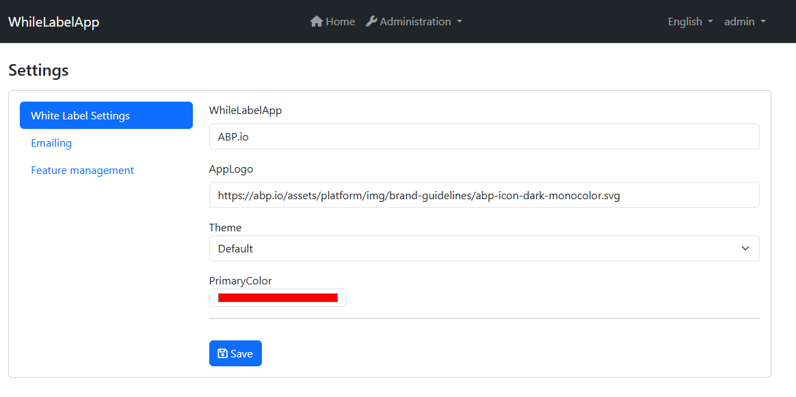
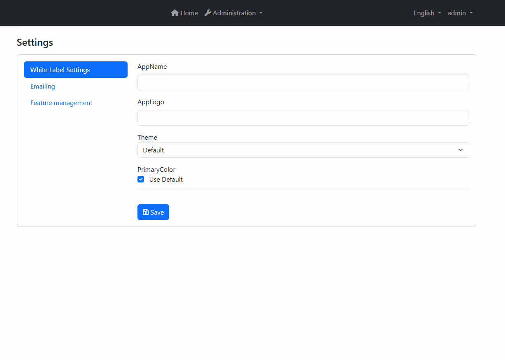
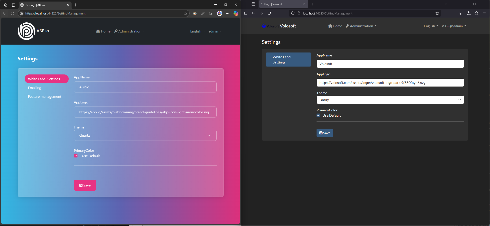

# White Labeling in ABP

ABP Framework covers all the **multi-tenant** features already and you can easily build a SAAS application with ABP Framework. But... "How about While Labeling? 

## White Labeling
White-labeling refers to the practice of developing a software solution that can be **rebranded** and **resold** by different companies under their own branding. So, our purpose is to build a software solution that can be **rebranded** by the tenant admin itself by changing the theme, logo, etc.


## Getting Started
I skip the steps to create a new ABP solution and go straight to the point. I'll show you how to white-label to your existing ABP solution. Let's see prerequisites first.

- An ABP solution in MVC UI with [Basic Theme](https://abp.io/docs/latest/framework/ui/mvc-razor-pages/basic-theme).
    -  _(other templates should be ok, but you need to use the correct components to override)_
- Setting Management module is installed. _(It's already installed in the ABP project templates)_

## Plan
The plan is to create a new setting group and settings in the Setting Management module to use different settings for each tenant. We'll provide a UI to the tenant admin to change the settings. Then, we'll use these settings to change the theme, logo, etc by overriding the theme components.


## Create a new setting group

Navigate to `WhileLabelAppSettingDefinitionProvider.cs` file and add a new setting that we'll use:


```cs
public class WhileLabelAppSettingDefinitionProvider : SettingDefinitionProvider
{
    public override void Define(ISettingDefinitionContext context)
    {
        // Skip the default values since we'll do not change anything if it's not set.
        context.Add(
            new SettingDefinition(WhileLabelAppSettings.AppName),
            new SettingDefinition(WhileLabelAppSettings.Theme),
            new SettingDefinition(WhileLabelAppSettings.AppLogo),
            new SettingDefinition(WhileLabelAppSettings.PrimaryColor)
        );
    }
}
```

```cs

// WhileLabelAppSettings.cs
public static class WhileLabelAppSettings
{
    private const string Prefix = "WhileLabelApp";
    public const string AppName = Prefix + "AppName";
    public const string AppLogo = Prefix + "AppLogo";
    public const string Theme = Prefix + "Theme";
    public const string PrimaryColor = Prefix + "PrimaryColor";
}
```

Now, we'll provide an API to get and update the settings by using Application Services. 

- Define a simple permission for the settings.
```cs
public class WhileLabelAppPermissionDefinitionProvider : PermissionDefinitionProvider
{
    public override void Define(IPermissionDefinitionContext context)
    {
        var myGroup = context.AddGroup(WhileLabelAppPermissions.GroupName);

        // Add related constant in WhileLabelAppPermissions.cs and add localization in en.json
        myGroup.AddPermission(WhileLabelAppPermissions.WhiteLabelSettings, L("Permission:WhiteLabelSettings"));
    }
    // ...
}
```

## Building the Settings UI
Now, we'll build the settings UI. We'll use the Setting Management module to create a new setting group and settings. Each tenant will see their own settings in the Setting Management page. To build this UI, we'll need to implement by using `ISettingManager` from **Setting Management** module. It provides keeping the settings tenant-specific.


- Create `IWhiteLabelSettingsAppService` interface in **Aplication.Contracts** project and `WhiteLabelSettingsAppService` class in **Application** project.

```cs

public interface IWhiteLabelSettingsAppService : IApplicationService
{
    Task<WhiteLabelSettingsDto> GetAsync();
    Task UpdateAsync(WhiteLabelSettingsDto input);
}

public class WhiteLabelSettingsDto
{
    public string? AppName { get; set; }
    public string? AppLogo { get; set; }
    public string? Theme { get; set; }
    public string? PrimaryColor { get; set; }
}
```

```cs
public class WhiteLabelSettingsAppService(ISettingManager settingManager) : ApplicationService, IWhiteLabelSettingsAppService   
{
    [Authorize(WhileLabelAppPermissions.WhiteLabelSettings)]
    public async Task<WhiteLabelSettingsDto> GetAsync()
    {
        return new WhiteLabelSettingsDto
        {
            AppName = await settingManager.GetOrNullForCurrentTenantAsync(WhileLabelAppSettings.AppName),
            AppLogo = await settingManager.GetOrNullForCurrentTenantAsync(WhileLabelAppSettings.AppLogo),
            Theme = await settingManager.GetOrNullForCurrentTenantAsync(WhileLabelAppSettings.Theme),
            PrimaryColor = await settingManager.GetOrNullForCurrentTenantAsync(WhileLabelAppSettings.PrimaryColor)
        };
    }

    [Authorize(WhileLabelAppPermissions.WhiteLabelSettings)]
    public async Task UpdateAsync(WhiteLabelSettingsDto input)
    {
        await settingManager.SetForCurrentTenantAsync(WhileLabelAppSettings.AppName, input.AppName);
        await settingManager.SetForCurrentTenantAsync(WhileLabelAppSettings.AppLogo, input.AppLogo);
        await settingManager.SetForCurrentTenantAsync(WhileLabelAppSettings.Theme, input.Theme);
        await settingManager.SetForCurrentTenantAsync(WhileLabelAppSettings.PrimaryColor, input.PrimaryColor);
    }
}
```

Now we're ready to build the UI. I'll use pre-defined bootstrap themes to allow tenants to choose a base design.

> Download 3 themes from [here](https://bootswatch.com/) and put them in the `wwwroot/themes` folder.
> I downloaded `darky`, `morph` and `quartz` themes and renamed them to `darky.min.css`, `morph.min.css` and `quartz.min.css` respectively. They all were `bootstrap.min.css` before renaming.

- Create a new ViewComponent in **Web** project.
  - `/Components/WhiteLabelSettings/Default.cshtml`
  - `/Components/WhiteLabelSettings/WhiteLabelSettingsViewComponent.cshtml.cs`

```html
@using Acme.WhileLabelApp.Settings
@model WhiteLabelSettingsDto

<form id="WhiteLabelSettingsForm">
    <abp-input asp-for="AppName" />
    <abp-input asp-for="AppLogo" />

    <div class="form-group mb-3">
        @Html.LabelFor(m => m.Theme)
        <select class="form-select" asp-for="Theme">
            <option value="">Default</option>
            <option value="darky">Darky</option>
            <option value="morph">Morph</option>
            <option value="quartz">Quartz</option>
        </select>
    </div>

    <div class="form-group">    
        @Html.LabelFor(m => m.PrimaryColor)
        <div class="mb-2">
            <input type="checkbox" id="useDefaultColor" class="form-check-input me-2" />
            <label for="useDefaultColor" class="form-check-label">Use Default</label>
        </div>
        <div id="colorPickerContainer">
            <input type="color" class="form-control w-25" asp-for="PrimaryColor" id="primaryColorPicker" />
        </div>
    </div>

    <hr />
    <abp-button type="submit" class="mt-3" button-type="Primary" text="Save" icon="fa-solid fa-save" />
</form>


<script>
    $(function() {
        const form = $('#WhiteLabelSettingsForm');
        const useDefaultCheckbox = $('#useDefaultColor');
        const colorPickerContainer = $('#colorPickerContainer');
        const primaryColorPicker = $('#primaryColorPicker');
        
        // Initialize checkbox state based on existing value
        
        @if (Model.PrimaryColor.IsNullOrEmpty())
        {
            <text>
                useDefaultCheckbox.prop('checked', true);
                colorPickerContainer.hide();
            </text>
        }
        
        // Handle checkbox change
        useDefaultCheckbox.change(function() {
            if (this.checked) {
                colorPickerContainer.hide();
                primaryColorPicker.val(''); // Clear the color picker value
            } else {
                colorPickerContainer.show();
            }
        });
        
        form.submit(function(e) {
            e.preventDefault();
            
            var data = form.serializeFormToObject();
            
            // If "Use Default" is checked, set PrimaryColor to null
            if (useDefaultCheckbox.prop('checked')) {
                data.PrimaryColor = null;
            }

            acme.whileLabelApp.settings.whiteLabelSettings.update(data).then(function() {
                abp.notify.success('White label settings updated successfully');
                window.location.reload();
            }).catch(function(error) {
                abp.notify.error(error.message);
            });
        });
    });
    
</script>
```

```cs
public class WhiteLabelSettingsViewComponent(IWhiteLabelSettingsAppService whiteLabelSettingsAppService) : AbpViewComponent
{
    public async Task<IViewComponentResult> InvokeAsync()
    {
        var settings = await whiteLabelSettingsAppService.GetAsync();
        return View("~/Components/WhiteLabelSettings/Default.cshtml", settings);
    }
}
```

- Create a new `WhiteLabelAppSettingPageContributor` to add the ViewComponent to the Setting Management page.

```cs
public class WhiteLabelAppSettingPageContributor : ISettingPageContributor
{
    public async Task<bool> CheckPermissionsAsync(SettingPageCreationContext context)
    {
        var authService = context.ServiceProvider.GetRequiredService<IAuthorizationService>();
        return await authService.IsGrantedAsync(WhileLabelAppPermissions.WhiteLabelSettings);
    }

    public Task ConfigureAsync(SettingPageCreationContext context)
    {
        var l = context.ServiceProvider.GetRequiredService<IStringLocalizer<WhileLabelAppResource>>();
         context.Groups.Add(
            new SettingPageGroup(
                "Volo.Abp.WhiteLabelSettingsGroup",
                l["WhiteLabelSettings"],
                typeof(WhiteLabelSettingsViewComponent),
                order : 1
            )
        );

        return Task.CompletedTask;
    }
}
```

- ⚠️ **Important** ⚠️
  - You need to add the `WhiteLabelAppSettingPageContributor` to the `SettingManagementPageOptions` in the `WhileLabelAppWebModule.cs` file.
```cs
Configure<SettingManagementPageOptions>(options =>
{
    options.Contributors.Add(new WhiteLabelAppSettingPageContributor());
});
```



## Applying the Styles


### Application Name & Logo
Now we're ready to apply the styles. Let's start with `BrandingProvider`.

```cs
[Dependency(ReplaceServices = true)]
public class WhileLabelAppBrandingProvider(
    IStringLocalizer<WhileLabelAppResource> l,
    ISettingProvider settingProvider
    ) : DefaultBrandingProvider
{
    public override string AppName 
    { 
        get 
        {
            var appNameSettingValue = settingProvider.GetOrNullAsync(WhileLabelAppSettings.AppName)
            .GetAwaiter().GetResult();
            
            return appNameSettingValue ?? l["AppName"];
        }
    }


    public override string? LogoUrl
    {
        get
        {
            var logoUrlSettingValue = settingProvider.GetOrNullAsync(WhileLabelAppSettings.AppLogo).GetAwaiter().GetResult();
            return logoUrlSettingValue ?? base.LogoUrl;
        }
    }
}
```

> ⚠️ Unfortunatelly, `BrandingProvider` doesn't support async operations since it implemented to use properties. 
> **As a best practice,** overriding the logo component from the theme is a better approach.


### Theme for each tenant
Now, we'll apply the bootstrap theme to the application. To achieve this, we'll create a new `BundleContributor` and override bundle files according to the setting value of the tenant.

- Create a new `WhiteLabelAppBundleContributor` class:
```cs
public class WhiteLabelAppBundleContributor(ISettingProvider settingProvider) : BundleContributor
{
    public override async Task ConfigureBundleAsync(BundleConfigurationContext context)
    {
        var theme = await settingProvider.GetOrNullAsync(WhileLabelAppSettings.Theme);

        if (theme.IsNullOrEmpty())
        {
            return;
        }

        context.Files.RemoveAll(f => f.FileName.Contains("bootstrap"));
        context.Files.Add($"/themes/{theme}.min.css");
    }
}
```

- Add the bundle contributor to the bundle:

```cs
 Configure<AbpBundlingOptions>(options =>
{
    options.StyleBundles.Configure(
        BasicThemeBundles.Styles.Global,
        bundle =>
        {
            bundle.AddFiles("/global-styles.css");
            // Add the bundle contributor to the bundle 👇
            bundle.AddContributors(typeof(WhiteLabelAppBundleContributor));
        }
    );

    // ...
});
```

### Primary Color
Now, we'll apply the primary color to the application. To achieve this, we'll need a new `style` as the latest element of the head section.

We'll use ABP's [Layout Hooks](https://abp.io/docs/latest/framework/ui/blazor/layout-hooks) feature to achieve this.

- Create a new component `BootstrapStyleViewComponent` class:

```cs
public class BootstrapStyleViewComponent(ISettingProvider settingProvider) : AbpViewComponent
{
    public async Task<IViewComponentResult> InvokeAsync()
    {
        var primaryColor = await settingProvider.GetOrNullAsync(WhileLabelAppSettings.PrimaryColor);
        return View("~/Components/BootstrapStyle/Default.cshtml", primaryColor);
    }
}
```

- Add the `Default.cshtml` file to the `Components/BootstrapStyle` folder:

```html
@model string
@if (Model.IsNullOrEmpty())
{
    return;
}
<style>
    body {
        --primary-color: @Model;
    }

    .btn-primary {
        background-color: var(--primary-color);
        border-color: var(--primary-color);
    }

    .btn-primary:hover {
        background-color: var(--primary-color);
        border-color: var(--primary-color);
        opacity: 0.8;
    }

    .btn-primary:focus {
        background-color: var(--primary-color);
        border-color: var(--primary-color);
        box-shadow: 0 0 0 0.25rem rgba(var(--primary-color), 0.25);
    }

    .bg-primary {
        background-color: var(--primary-color);
    }

    .text-primary {
        color: var(--primary-color);
    }

    .border-primary {
        border-color: var(--primary-color);
    }

    .btn-outline-primary {
        border-color: var(--primary-color);
        color: var(--primary-color);
    }

    .btn-outline-primary:hover {
        background-color: var(--primary-color);
        border-color: var(--primary-color);
        color: var(--primary-color);
    }

    .btn-outline-primary:focus {
        background-color: var(--primary-color);
        border-color: var(--primary-color);
        color: var(--primary-color);
    }

    .nav-pills .nav-link.active, .nav-pills .show>.nav-link {
        background-color: var(--primary-color);
    }

    .nav-link.active:hover {
        background-color: var(--primary-color);
        opacity: 0.8;
    }
</style>
```

## Result
Now, you can see the result. You can easily customize the application by using the Setting Management page.


Now create another tenant and switch to the new tenant. You can see the application is opened without any changes when you switch to the new tenant. Login with the new tenant's credentials and you can see the tenant has its own branding that it can customize itself.



## Source Code
You can find the source code of the example application in [GitHub](https://github.com/enisn/Acme.WhileLabelApp).


## Conclusion
ABP Framework provides a powerful set of features to implement white-labeling easily in your application. This tutorial is a proof of concept to show how to implement white-labeling in your application.

